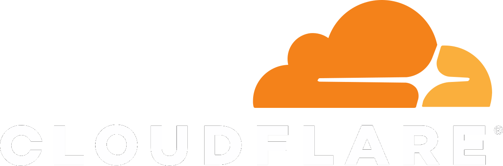
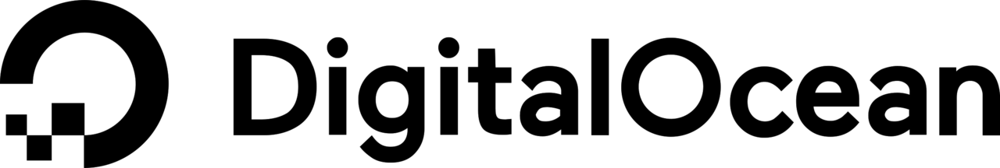

# 🌐 FreeDomains - Claim Your Free Domain Today

**Free managed subdomain service for developers, students, and open-source communities**

[](https://github.com/stackryze/FreeDomains)
[](https://github.com/stackryze/FreeDomains/stargazers)
[](LICENSE)
[](https://discord.gg/wr7s97cfM7)

**Join our Discord:** https://discord.gg/wr7s97cfM7

---

## 🎯 Overview

**Stackryze Domains** operates **indevs.in** & **sryze.cc**, providing free managed subdomain services for the developer community. Claim a domain and point it to any hosting provider or your own infrastructure with full ownership and complete control.

**Build fast. Deploy freely. No lock-in.**

---

## ✨ Features

- 🆓 **Completely Free** - No hidden costs or subscriptions
- 🌐 **Multiple Extensions** - Choose from available domain extensions
- 🚀 **Any Hosting Provider** - Works with Vercel, Netlify, GitHub Pages, and more
- 🔧 **Full Control** - Complete DNS management capabilities
- 🌍 **Global DNS** - Reliable, globally distributed nameservers
- 👥 **Community Driven** - Built for developers, students, and OSS projects
- 📱 **Easy Management** - Simple web interface for domain management

---

## 🌍 Available Domains

- **.indevs.in** - Perfect for development projects
- **.sryze.cc** - Great for personal and community projects

*More extensions coming soon.*

---

## 🌐 DNS Infrastructure

Stackryze Domains are backed by globally distributed nameservers for reliability and low latency:

- **ns1.stackryze.com** — Primary nameserver (Germany)
- **ns2.stackryze.com** — Secondary nameserver (Global)

---

## 🚀 Quick Start

### Prerequisites

- Node.js (v16 or higher)
- npm or yarn package manager

### Installation

1. **Clone the repository**
   ```bash
   git clone https://github.com/stackryze/FreeDomains.git
   cd FreeDomains
   ```

2. **Install dependencies**
   ```bash
   npm install
   ```

3. **Set up environment variables**
   ```bash
   cp .env.example .env
   # Edit .env with your configuration
   ```

4. **Run the development server**
   ```bash
   npm start
   ```

5. **Open your browser**
   Navigate to `http://localhost:3000`

### Using Docker

```bash
# Build and run with Docker
docker build -t freedomains .
docker run -p 3000:3000 freedomains
```

---

## 💻 Usage

### Claiming a Domain

1. Visit the FreeDomains website
2. Check domain availability
3. Submit your domain request with:
   - Desired subdomain name
   - Target destination (IP address or CNAME)
   - Purpose/description of your project
4. Wait for approval (usually within 24 hours)
5. Configure your DNS settings once approved

### Supported DNS Records

- **A Records** - Point to IPv4 addresses
- **AAAA Records** - Point to IPv6 addresses  
- **CNAME Records** - Point to other domain names
- **MX Records** - Mail exchange records
- **TXT Records** - Text records for verification

---

## 🤝 Contributing

We welcome contributions from the community! Here's how you can help:

### Getting Started

1. Fork the repository
2. Create a feature branch (`git checkout -b feature/amazing-feature`)
3. Make your changes
4. Run the linter (`npm run lint`)
5. Commit your changes (`git commit -m 'Add some amazing feature'`)
6. Push to the branch (`git push origin feature/amazing-feature`)
7. Open a Pull Request

### Code Style

- Follow ESLint configuration (see `eslint.config.js`)
- Use meaningful commit messages
- Add comments for complex logic
- Update documentation when needed

### Reporting Issues

- Use GitHub Issues for bug reports and feature requests
- Provide detailed information about the issue
- Include steps to reproduce if applicable

---

## 🏢 Sponsors

Special thanks to our sponsors who help keep this service free:

<p align="center">
  
  
  
  
  
</p>

---

## 📄 License

This project is licensed under the terms specified in the [LICENSE](LICENSE) file.

---

## 📞 Support

- **Discord Community:** https://discord.gg/wr7s97cfM7
- **GitHub Issues:** [Report a bug or request a feature](https://github.com/stackryze/FreeDomains/issues)
- **Email:** Contact us through our Discord server

---

## 🎯 Goals

Our mission is simple: remove cost and complexity from getting online.

- Provide free, reliable domain services
- Support the developer and student community
- Foster open-source development
- Maintain transparent, community-driven operations

---

*Documentation improved by [Codec8](https://codec8.com) — AI-powered docs for GitHub repos. [Generate docs for your repo →](https://codec8.com)*